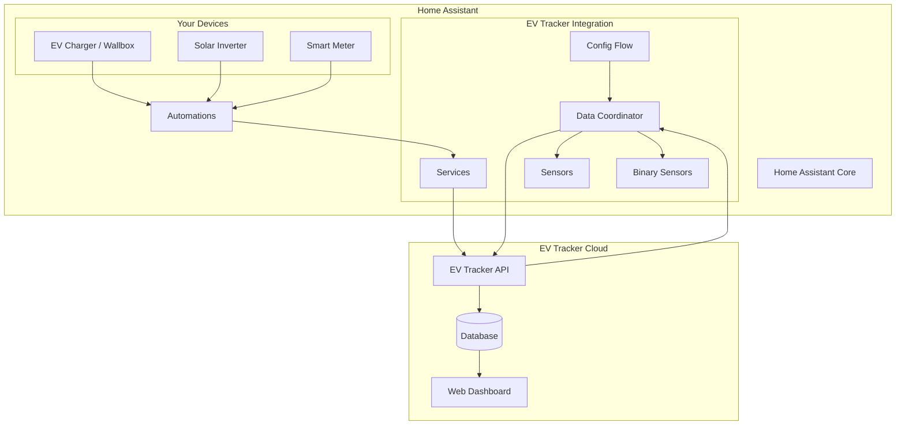
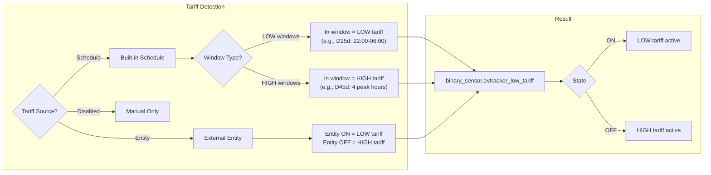
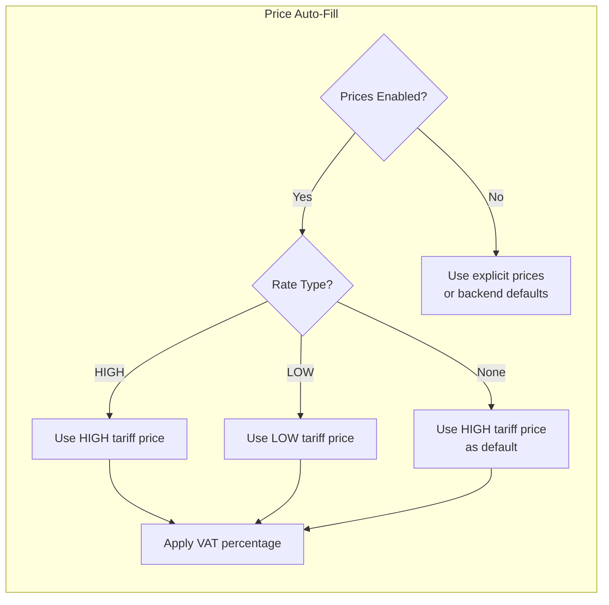
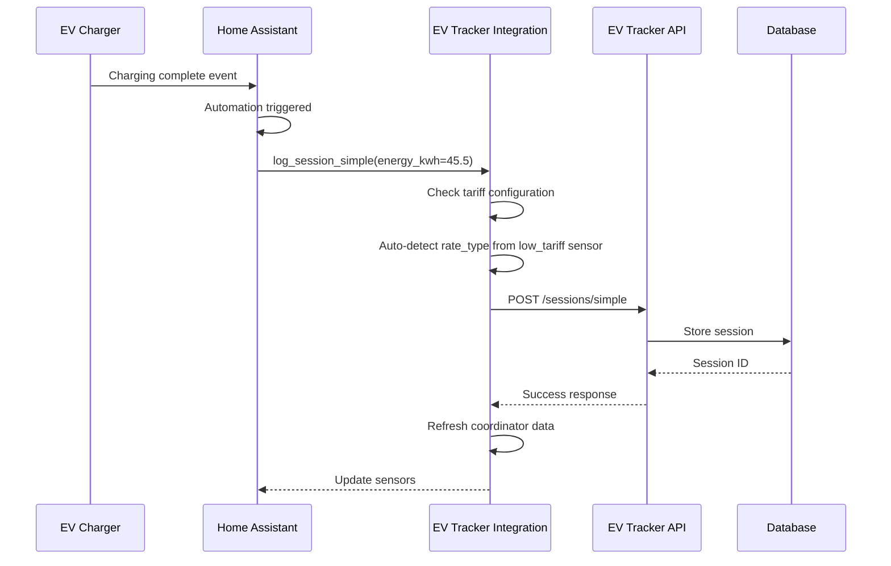

# EV Tracker Integration for Home Assistant

[](https://github.com/hacs/integration)
[](https://github.com/evtracker/homeassistant-evtracker/releases)
[](https://github.com/evtracker/homeassistant-evtracker/blob/main/LICENSE)
[](https://github.com/evtracker/homeassistant-evtracker/actions)
[](https://www.python.org/)
[](https://www.home-assistant.io/)
[](https://github.com/psf/black)
[](https://github.com/astral-sh/ruff)

Track your electric vehicle charging costs with [EV Tracker](https://evtracker.cz). This integration allows you to automatically log charging sessions from Home Assistant and view your charging statistics.

## Features

- **Automatic Session Logging**: Log charging sessions from any smart plug, wallbox, or EV charger integration
- **Dual-Tariff Support**: Track HIGH/LOW electricity tariffs for accurate cost analysis with built-in schedule or external entity
- **Solar/Grid Tracking**: Distinguish between grid and solar charging
- **Sensors**: View monthly and yearly charging statistics directly in Home Assistant
- **Services**: Call services from automations to log sessions
- **Idempotency**: Duplicate prevention ensures sessions are only logged once

## Architecture



## Requirements

- [EV Tracker](https://evtracker.cz) account with **PRO subscription**
- API key from EV Tracker (Settings > API Keys)

## Installation

### HACS (Recommended)

1. Open HACS in Home Assistant
2. Click on "Integrations"
3. Click the three dots in the top right corner
4. Select "Custom repositories"
5. Add `https://github.com/evtracker/homeassistant-evtracker` as an Integration
6. Click "Install"
7. Restart Home Assistant

### Manual Installation

1. Download the latest release from [GitHub Releases](https://github.com/evtracker/homeassistant-evtracker/releases)
2. Extract and copy the `custom_components/evtracker` folder to your Home Assistant `config/custom_components/` directory
3. Restart Home Assistant

## Configuration

1. Go to **Settings** > **Devices & Services**
2. Click **Add Integration**
3. Search for "EV Tracker"
4. Enter your API key
5. Select your car

You can add the integration multiple times if you have multiple cars.

## Sensors

| Entity                                          | Description                           | Unit    |
|-------------------------------------------------|---------------------------------------|---------|
| `sensor.evtracker_<car_id>_monthly_energy`      | Energy charged this month             | kWh     |
| `sensor.evtracker_<car_id>_monthly_cost`        | Total cost this month                 | CZK     |
| `sensor.evtracker_<car_id>_monthly_sessions`    | Number of sessions this month         | -       |
| `sensor.evtracker_<car_id>_yearly_energy`       | Energy charged this year              | kWh     |
| `sensor.evtracker_<car_id>_yearly_cost`         | Total cost this year                  | CZK     |
| `sensor.evtracker_<car_id>_last_session_energy` | Last session energy                   | kWh     |
| `sensor.evtracker_<car_id>_last_session_cost`   | Last session cost                     | CZK     |
| `sensor.evtracker_<car_id>_avg_cost_per_kwh`    | Average cost per kWh                  | CZK/kWh |
| `binary_sensor.evtracker_<car_id>_connected`    | API connection status                 | -       |
| `binary_sensor.evtracker_<car_id>_low_tariff`   | Current tariff (ON = LOW, OFF = HIGH) | -       |

> **Note:** The `low_tariff` binary sensor is only created when tariff tracking is enabled in the integration options.

## Services

### evtracker.log_session

Log a charging session with full control over all fields.

```yaml
service: evtracker.log_session
data:
  energy_kwh: 45.5
  start_time: "2024-01-15T08:00:00"
  end_time: "2024-01-15T10:30:00"
  location: "Home"
  energy_source: "GRID"
  rate_type: "LOW"
  price_per_kwh: 4.50
  vat_percentage: 21
  external_id: "wallbox_001"
```

| Field            | Required | Description                                         |
|------------------|----------|-----------------------------------------------------|
| `energy_kwh`     | Yes      | Energy consumed in kWh                              |
| `start_time`     | No       | When charging started (ISO 8601)                    |
| `end_time`       | No       | When charging ended (ISO 8601)                      |
| `car_id`         | No       | Car ID (uses default if not specified)              |
| `location`       | No       | Charging location (default: "Home")                 |
| `external_id`    | No       | Unique ID for idempotency                           |
| `provider`       | No       | Charging provider (HOME, CEZ, EOON, PRE, etc.)      |
| `energy_source`  | No       | Energy source: `GRID` or `SOLAR`                    |
| `rate_type`      | No       | Tariff rate: `HIGH` (peak) or `LOW` (off-peak)      |
| `price_per_kwh`  | No       | Price per kWh without VAT                           |
| `vat_percentage` | No       | VAT percentage (e.g., 21 for 21%)                   |
| `notes`          | No       | Additional notes                                    |

### evtracker.log_session_simple

Quick logging with minimal data - uses smart defaults from your EV Tracker settings.

```yaml
service: evtracker.log_session_simple
data:
  energy_kwh: 45.5
  energy_source: "GRID"
  rate_type: "LOW"
```

| Field           | Required | Description                                    |
|-----------------|----------|------------------------------------------------|
| `energy_kwh`    | Yes      | Energy consumed in kWh                         |
| `start_time`    | No       | When charging started (estimated if omitted)   |
| `end_time`      | No       | When charging ended (defaults to now)          |
| `car_id`        | No       | Car ID (uses default if not specified)         |
| `location`      | No       | Charging location (default: "Home")            |
| `external_id`   | No       | Unique ID for idempotency                      |
| `energy_source` | No       | Energy source: `GRID` or `SOLAR`               |
| `rate_type`     | No       | Tariff rate: `HIGH` (peak) or `LOW` (off-peak) |

## Dual-Tariff Electricity (HIGH/LOW)

Many electricity providers offer dual-rate plans where electricity is cheaper during off-peak hours (typically nights and weekends). EV Tracker can track this to give you accurate cost analysis.



### Setting Up Tariff Tracking

#### Option 1: Built-in Schedule (Recommended)

Configure tariff schedules directly in the integration options - no YAML required!

1. Go to **Settings** > **Devices & Services** > **EV Tracker**
2. Click **Configure**
3. Select **"Configure schedule"** for tariff tracking
4. Choose window type:
   - **"Windows define LOW tariff periods"** - for tariffs like D25d (8 hours low at night)
   - **"Windows define HIGH tariff periods"** - for tariffs like D45d (only 4 peak hours)
5. Configure up to 4 time windows
6. Optionally enable "Weekend always LOW"

**Example: D25d Tariff** (8 hours low tariff at night)
- Window type: "Windows define LOW tariff periods"
- Window 1: 22:00 - 06:00
- Weekend always LOW: Optional

**Example: D45d Tariff** (20 hours low, 4 hours high)
- Window type: "Windows define HIGH tariff periods"
- Window 1: 07:00 - 08:00
- Window 2: 11:00 - 12:00
- Window 3: 17:00 - 18:00
- Window 4: 19:00 - 20:00

This creates a `binary_sensor.evtracker_<car_id>_low_tariff` entity that automatically tracks the current tariff.

#### Option 2: Use Existing Entity

Point to any existing binary sensor, input_boolean, or sensor that indicates low tariff:

1. Go to **Settings** > **Devices & Services** > **EV Tracker**
2. Click **Configure**
3. Select **"Use existing entity"**
4. Select your tariff entity (ON = LOW tariff, OFF = HIGH tariff)

#### Option 3: Create Your Own Binary Sensor

If you need more complex logic, create a binary sensor in YAML:

```yaml
# configuration.yaml
binary_sensor:
  - platform: tod
    name: Low Tariff
    after: "22:00"
    before: "06:00"
```

Or for weekday-aware schedules:

```yaml
template:
  - binary_sensor:
      - name: "Low Tariff"
        state: >
          
          
          
            true
          
            true
          
            false
          
```

Then configure the integration to use this entity (Option 2).

#### Option 4: From Smart Meter

If you have a smart meter integration (e.g., Shelly EM, P1 meter), it may provide the current tariff directly.

## Price Configuration

Configure default electricity prices in the integration options. When enabled, these prices are automatically applied when logging sessions via `evtracker.log_session`.



### Setting Up Price Defaults

1. Go to **Settings** > **Devices & Services** > **EV Tracker**
2. Click **Configure**
3. Complete the tariff configuration (or select "Disabled")
4. On the **Price Configuration** step:
   - Enable **"Enable price auto-fill"**
   - Set **HIGH tariff price** (price per kWh without VAT)
   - Set **LOW tariff price** (price per kWh without VAT, if different)
   - Set **VAT percentage** (e.g., 21 for Czech Republic)

### How It Works

When `evtracker.log_session` is called without `price_per_kwh`:
1. The integration checks if price auto-fill is enabled
2. Based on the detected (or provided) `rate_type`, it selects the appropriate price
3. The configured VAT percentage is applied

**Example:**
- HIGH tariff price: 5.50 CZK/kWh
- LOW tariff price: 3.50 CZK/kWh
- VAT: 21%

If you log a session during LOW tariff without specifying a price:
- `price_per_kwh` = 3.50 CZK
- `vat_percentage` = 21%
- Total cost calculated by EV Tracker: 3.50 × 1.21 = 4.235 CZK/kWh

> **Note:** The `log_session_simple` service uses prices from your EV Tracker account settings (web app), not from Home Assistant configuration.

### Auto-Detection of Rate Type

When tariff tracking is configured (schedule or entity), the `rate_type` is **automatically detected** when logging sessions. You don't need to specify it manually:

```yaml
# rate_type is auto-detected from your tariff configuration!
service: evtracker.log_session_simple
data:
  energy_kwh: 45.5
```

### Using Tariff in Automations

If you prefer explicit control, you can still specify the rate_type manually:

```yaml
automation:
  - alias: "Log EV Charging with Tariff"
    trigger:
      - platform: state
        entity_id: binary_sensor.wallbox_charging
        from: "on"
        to: "off"
    action:
      - service: evtracker.log_session_simple
        data:
          energy_kwh: "{{ states('sensor.wallbox_energy_session') | float }}"
          rate_type: "{{ 'LOW' if is_state('binary_sensor.evtracker_123_low_tariff', 'on') else 'HIGH' }}"
```

## Automation Examples



### Basic: Log from Smart Plug

```yaml
automation:
  - alias: "Log EV Charging from Smart Plug"
    trigger:
      - platform: numeric_state
        entity_id: sensor.ev_charger_power
        below: 50
        for:
          minutes: 5
    condition:
      - condition: numeric_state
        entity_id: sensor.ev_charger_session_energy
        above: 1
    action:
      - service: evtracker.log_session_simple
        data:
          energy_kwh: "{{ states('sensor.ev_charger_session_energy') | float }}"
```

### With Solar Detection and Tariff

```yaml
automation:
  - alias: "Log EV Charging with Solar and Tariff"
    trigger:
      - platform: state
        entity_id: binary_sensor.wallbox_charging
        from: "on"
        to: "off"
    variables:
      solar_power: "{{ states('sensor.solar_power') | float(0) }}"
      charger_power: "{{ states('sensor.wallbox_power') | float(0) }}"
      # If solar covers more than 80% of charging power, consider it solar
      is_solar: "{{ solar_power > (charger_power * 0.8) }}"
      is_low_tariff: "{{ is_state('binary_sensor.low_tariff', 'on') }}"
    action:
      - service: evtracker.log_session
        data:
          energy_kwh: "{{ states('sensor.wallbox_energy_session') | float }}"
          start_time: "{{ state_attr('binary_sensor.wallbox_charging', 'session_start') }}"
          end_time: "{{ now().isoformat() }}"
          location: "Home"
          energy_source: "{{ 'SOLAR' if is_solar else 'GRID' }}"
          rate_type: "{{ 'LOW' if is_low_tariff else 'HIGH' }}"
          external_id: "wallbox_{{ now().timestamp() | int }}"

```

### Tesla Integration

```yaml
automation:
  - alias: "Log Tesla Charging"
    trigger:
      - platform: state
        entity_id: binary_sensor.tesla_charger
        from: "on"
        to: "off"
        for:
          minutes: 2
    action:
      - service: evtracker.log_session
        data:
          energy_kwh: "{{ states('sensor.tesla_charger_energy_added') | float }}"
          start_time: "{{ state_attr('binary_sensor.tesla_charger', 'charging_started') }}"
          end_time: "{{ now().isoformat() }}"
          location: "Home"
          rate_type: "{{ 'LOW' if is_state('binary_sensor.low_tariff', 'on') else 'HIGH' }}"
          external_id: "tesla_{{ now().timestamp() | int }}"
```

### Wallbox Integration (Pulsar, Commander, etc.)

```yaml
automation:
  - alias: "Log Wallbox Charging"
    trigger:
      - platform: state
        entity_id: sensor.wallbox_status
        from: "Charging"
        to: "Connected"
    condition:
      - condition: numeric_state
        entity_id: sensor.wallbox_added_energy
        above: 0.5
    action:
      - service: evtracker.log_session_simple
        data:
          energy_kwh: "{{ states('sensor.wallbox_added_energy') | float }}"
          rate_type: "{{ 'LOW' if is_state('binary_sensor.low_tariff', 'on') else 'HIGH' }}"
          external_id: "wallbox_{{ states('sensor.wallbox_session_id') }}"
```

### OpenEVSE / EmonEVSE

```yaml
automation:
  - alias: "Log OpenEVSE Charging"
    trigger:
      - platform: state
        entity_id: sensor.openevse_state
        from: "charging"
        to: "connected"
    action:
      - service: evtracker.log_session
        data:
          energy_kwh: "{{ states('sensor.openevse_session_energy') | float }}"
          start_time: "{{ states('sensor.openevse_session_start') }}"
          end_time: "{{ now().isoformat() }}"
          energy_source: "{{ 'SOLAR' if states('sensor.openevse_solar_percentage') | float > 80 else 'GRID' }}"
          rate_type: "{{ 'LOW' if is_state('binary_sensor.low_tariff', 'on') else 'HIGH' }}"
          external_id: "evse_{{ states('sensor.openevse_session_id') }}"
```

### go-e Charger

```yaml
automation:
  - alias: "Log go-e Charging"
    trigger:
      - platform: state
        entity_id: sensor.goe_charger_car_status
        from: "Charging"
        to: "Waiting for car"
    action:
      - service: evtracker.log_session_simple
        data:
          energy_kwh: "{{ states('sensor.goe_charger_session_energy') | float }}"
          rate_type: "{{ 'LOW' if is_state('binary_sensor.low_tariff', 'on') else 'HIGH' }}"
          external_id: "goe_{{ now().timestamp() | int }}"
```

## REST Command Alternative

If you prefer not to use the custom integration, you can use Home Assistant's built-in REST command:

```yaml
# configuration.yaml
rest_command:
  evtracker_log_session:
    url: https://api.evtracker.cz/api/v1/sessions/simple
    method: POST
    headers:
      x-api-key: !secret ev_tracker_api_key
      Content-Type: application/json
    payload: >
      {
        "energyConsumedKwh": {{ energy }},
        "location": "{{ location | default('Home') }}",
        "energySource": "{{ energy_source | default('GRID') }}",
        "rateType": "{{ rate_type | default('') }}",
        "externalId": "{{ external_id | default('ha_' ~ now().timestamp() | int) }}"
      }
    content_type: application/json
```

Usage:

```yaml
service: rest_command.evtracker_log_session
data:
  energy: 25.5
  rate_type: LOW
  energy_source: GRID
```

## Troubleshooting

### API Key Issues

- Ensure you have a PRO subscription on EV Tracker
- Generate a new API key from Settings > API Keys
- Check that the API key has not been revoked

### Connection Issues

- Check the `binary_sensor.evtracker_connected` entity
- Verify your network can reach `api.evtracker.cz`
- Check Home Assistant logs for error messages

### Duplicate Sessions

Use the `external_id` field to prevent duplicates. The API is idempotent - if you send the same `external_id` twice, it will return the existing session instead of creating a duplicate.

### Rate Type Not Saving

- Ensure you're using `HIGH` or `LOW` (case-insensitive)
- Check that the session was created after the rate_type feature was enabled

### Debug Logging

Add this to your `configuration.yaml` for detailed logs:

```yaml
logger:
  default: info
  logs:
    custom_components.evtracker: debug
```

## Energy Source vs Rate Type

| Field           | Purpose                                      | Values           |
|-----------------|----------------------------------------------|------------------|
| `energy_source` | Where the electricity came from              | `GRID`, `SOLAR`  |
| `rate_type`     | What tariff was active during charging       | `HIGH`, `LOW`    |

You can use both together:
- Grid charging during low tariff: `energy_source: GRID`, `rate_type: LOW`
- Solar charging (tariff doesn't matter): `energy_source: SOLAR`, `rate_type:` (empty or omit)

## Czech Electricity Tariffs

Common dual-tariff schedules in Czech Republic:

| Tariff   | Low Tariff Hours                              |
|----------|-----------------------------------------------|
| D25d     | 8 hours daily (typically 22:00-06:00)         |
| D26d     | 8 hours daily + weekends                      |
| D27d     | 8 hours daily + heat pump bonus               |
| D45d     | 20 hours daily (only 4 peak hours)            |
| D57d     | Unlimited low tariff for EV + heat pump       |

Example binary sensor for D25d tariff:

```yaml
binary_sensor:
  - platform: tod
    name: Low Tariff D25d
    after: "22:00"
    before: "06:00"
```

## Support

- [EV Tracker Website](https://evtracker.cz)
- [GitHub Issues](https://github.com/evtracker/homeassistant-evtracker/issues)
- [EV Tracker Support](https://evtracker.cz/support)

## License

This project is licensed under the MIT License - see the [LICENSE](LICENSE) file for details.
